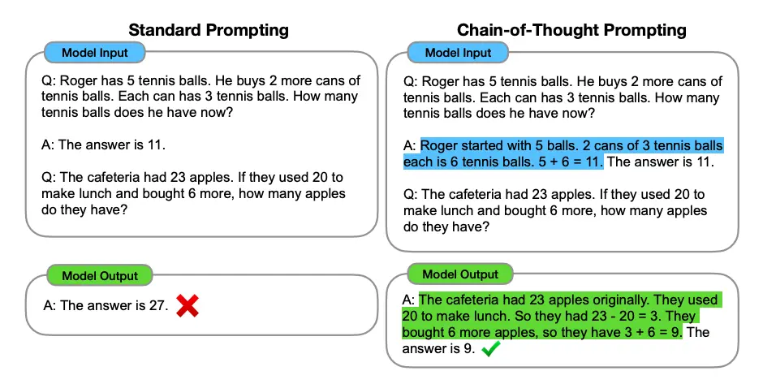
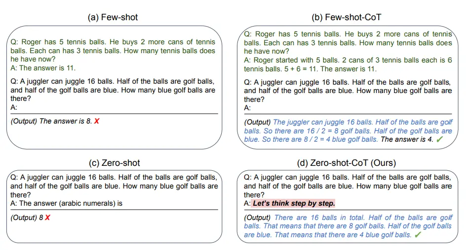
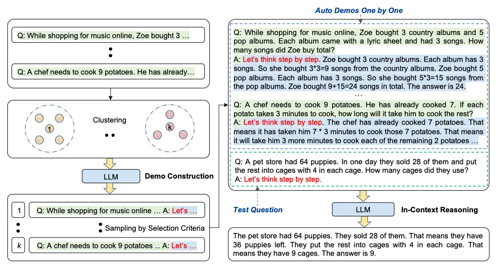
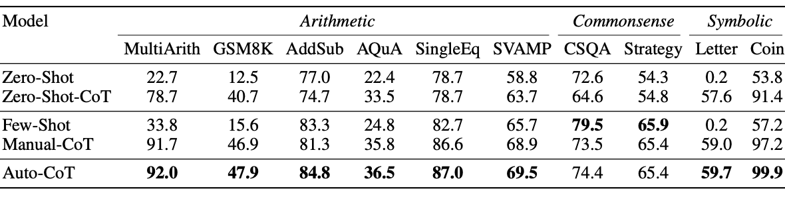
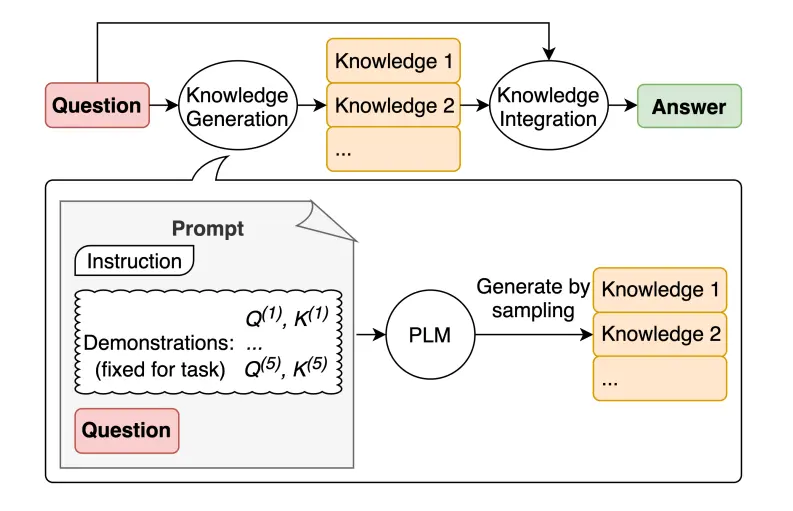
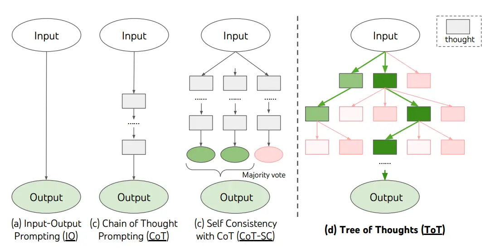
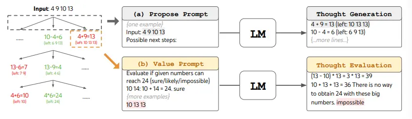
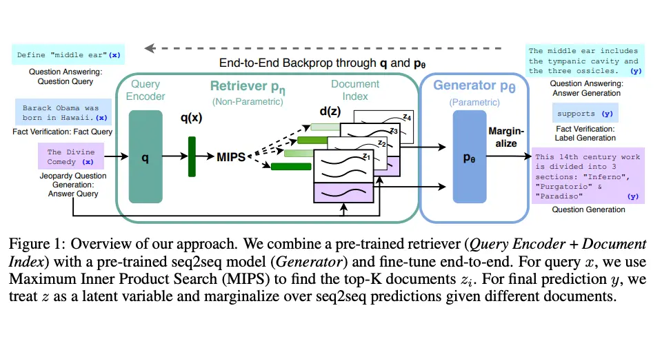

# 提示词技术

记录目前为止，提示词技术的相关内容，算是笔记。

**以下示例基于一些模型的能力预设，实际结果根据模型能力不同而不同，主要是为了说明提示词技术的概念和应用。**

## 零样本提示（Zero-Shot Prompting）

零样本提示（Zero-Shot Prompting）是指在没有提供任何示例的情况下，直接向语言模型提出一个问题或任务。模型需要根据其预训练的知识和理解能力来生成答案。这种方法依赖于模型的泛化能力，适用于一些简单的问题或任务。

```text
输入：
将文本分类为中性、负面或正面。
文本：我认为这次假期还可以。
情感：

输出：
中性
```

## 少样本提示（Few-Shot Prompting）

- 虽然大型语言模型在零样本提示中表现出色，但在某些情况下，提供一些示例可以帮助模型更好地理解任务要求。
- **少样本提示**（Few-Shot Prompting）是指在提示中包含少量示例，以指导模型生成更准确的答案。这些示例可以帮助模型更好地理解任务的结构和预期的输出格式。

```text
输入：
将文本分类为中性、负面或正面。
文本：我认为这次假期还可以。
情感：中性
文本：我非常喜欢这次假期。
情感：

输出：
正面
```
### 使用技巧
- “标签空间和演示指定的输入文本的分布都很重要（无论标签是否对单个输入正确）”
- 使用的格式也对性能起着关键作用，即使只是使用随机标签，这也比没有标签好得多。
- 从真实标签分布（而不是均匀分布）中选择随机标签也有帮助。

```text
随机标签示例
输入：
这太棒了！// Negative
这太糟糕了！// Positive
哇，那部电影太棒了！// Positive
多么可怕的节目！//

输出：
Negative
```

### 限制
标准的少样本提示对许多任务都有效，但并不是一种完美的技术，特别是在处理更复杂的推理任务时。

```text
推理任务
输入：
这组数字中的奇数加起来是一个偶数：15、32、5、13、82、7、1。

输出：
是的，这组数字中的奇数加起来是107，是一个偶数。
```

---

再试试增加示例的版本
```text
增加示例
输入：
这组数字中的奇数加起来是一个偶数：4、8、9、15、12、2、1。
A：答案是False。

这组数字中的奇数加起来是一个偶数：17、10、19、4、8、12、24。
A：答案是True。

这组数字中的奇数加起来是一个偶数：16、11、14、4、8、13、24。
A：答案是True。

这组数字中的奇数加起来是一个偶数：17、9、10、12、13、4、2。
A：答案是False。

这组数字中的奇数加起来是一个偶数：15、32、5、13、82、7、1。
A：

输出：
答案是True。
```
## 链式思考（CoT）提示

- 链式思考（Chain-of-Thought Prompting）是一种提示词技术，旨在引导语言模型通过一系列推理步骤来解决复杂问题。

- 这种方法通过在提示中包含多个推理步骤的示例，帮助模型更好地理解任务的结构和要求，从而生成更准确的答案。

- 改造下少样本提示，结合 CoT
```text
输入：
这组数中的奇数加起来是偶数：4、8、9、15、12、2、1。
A：将所有奇数相加（9、15、1）得到25。答案为False。

这组数中的奇数加起来是偶数：15、32、5、13、82、7、1。
A：

输出：
将所有奇数相加（15、5、13、7、1）得到41。答案为False。
```

### 零样本 COT 提示


区别显而易见，去除了样本示例，增加了【**让我们逐步思考**】

```text
输入：
我去市场买了10个苹果。我给了邻居2个苹果和修理工2个苹果。然后我去买了5个苹果并吃了1个。我还剩下多少苹果？

让我们逐步思考。

输出：
首先，您从10个苹果开始。
您给了邻居和修理工各2个苹果，所以您还剩下6个苹果。
然后您买了5个苹果，所以现在您有11个苹果。
最后，您吃了1个苹果，所以您还剩下10个苹果。
```
这个简单的提示在任务中非常有效，特别是在没有太多示例的情况下非常有用

### 自动思维链（Auto-CoT）



解析自动思维链时，先了解 CoT 的弊端
#### CoT 弊端
- 使用思维链提示时，能提供少样本 CoT （Few-Shot CoT）效果好于零样本 CoT（Zero-Shot CoT）。
- 思维链在生成一个接一个的推理链时仍然可能出错。

#### Auto-CoT 做了什么？为什么它比 CoT 更好？
> 做了什么？

Auto-CoT 主要由两个阶段组成：

- 阶段1：问题聚类：将给定问题划分为几个聚类。
- 阶段2：演示抽样：从每组数组中选择一个具有代表性的问题，并使用带有简单启发式的 Zero-Shot-CoT 生成其推理链。

Auto-CoT 的核心思想是：让大模型自己为自己生成思维链示例，既消除人工瓶颈，又能利用模型内部知识产生更自然的分解路径。

> 为什么更好？

- 其实通过以上阶段就明白 Auto-CoT 高度相似数学上的分而治之。
- 将大问题进行拆解，再针对问题的不同类型生成更具针对性的思维链示例，能更有效地引导模型进行推理。
- 不仅拆解了问题，还利用了模型自身的能力来生成更合适的示例，结果显而易见。

[相关链接](https://github.com/amazon-science/auto-cot)

## 自我一致性

了解这个概念前先看一个示例

```text
输入：
当我6岁时，我的妹妹是我的一半年龄。现在我70岁了，我的妹妹多大？

输出：
35
```

再看看官方定义：
- 自我一致性旨在“替换链式思维提示中使用的天真**贪婪解码**方法”。其想法是通过少样本 CoT 采样多个不同的推理路径，并使用生成结果选择最一致的答案。
- 这有助于提高 CoT 提示在涉及算术和常识推理的任务中的性能。

> 什么是天真贪婪解码方法？
>
> 每一步都选概率最高的词，整条链只有一个输出。 

### 原理
自我一致性的做法是：

- 对同一个问题，让模型用非零温度采样（`temperature` > 0） 生成多条不同的推理路径。

- 提取每条路径的最终答案（忽略推理过程）。

- 取出现次数最多的答案作为最终输出，即多数投票。

核心直觉：**通往正确答案的推理路径可能多种多样，但随机犯错是发散的，只有稳定指向同一结果的那些路径才更可信。**

---

### 实施
已知以上文本实例结果错误，那么如何通过自我一致性改进呢？

提供样本范例
```text
Q：林中有15棵树。林业工人今天将在林中种树。完成后，将有21棵树。林业工人今天种了多少棵树？
A：我们从15棵树开始。后来我们有21棵树。差异必须是他们种树的数量。因此，他们必须种了21-15 = 6棵树。答案是6。

Q：停车场有3辆汽车，又来了2辆汽车，停车场有多少辆汽车？
A：停车场已经有3辆汽车。又来了2辆。现在有3 + 2 = 5辆汽车。答案是5。

Q：Leah有32块巧克力，她的姐姐有42块。如果他们吃了35块，他们总共还剩多少块？
A：Leah有32块巧克力，Leah的姐姐有42块。这意味着最初有32 + 42 = 74块巧克力。已经吃了35块。因此，他们总共还剩74-35 = 39块巧克力。答案是39。

Q：Jason有20个棒棒糖。他给Denny一些棒棒糖。现在Jason只有12个棒棒糖。Jason给Denny多少棒棒糖？
A：Jason有20个棒棒糖。因为他现在只有12个，所以他必须把剩下的给Denny。他给Denny的棒棒糖数量必须是20-12 = 8个棒棒糖。答案是8。

Q：Shawn有五个玩具。圣诞节，他从他的父母那里得到了两个玩具。他现在有多少个玩具？
A：他有5个玩具。他从妈妈那里得到了2个，所以在那之后他有5 + 2 = 7个玩具。然后他从爸爸那里得到了2个，所以总共他有7 + 2 = 9个玩具。答案是9。

Q：服务器房间里有9台计算机。从周一到周四，每天都会安装5台计算机。现在服务器房间里有多少台计算机？
A：从周一到周四有4天。每天都添加了5台计算机。这意味着总共添加了4 * 5 =
20台计算机。一开始有9台计算机，所以现在有9 + 20 = 29台计算机。答案是29。

Q：Michael有58个高尔夫球。星期二，他丢失了23个高尔夫球。星期三，他又丢失了2个。星期三结束时他还剩多少个高尔夫球？
A：Michael最初有58个球。星期二他丢失了23个，所以在那之后他有58-23 = 35个球。星期三他又丢失了2个，所以现在他有35-2 = 33个球。答案是33。

Q：Olivia有23美元。她用每个3美元的价格买了五个百吉饼。她还剩多少钱？
A：她用每个3美元的价格买了5个百吉饼。这意味着她花了15美元。她还剩8美元。

Q：当我6岁时，我的妹妹是我的一半年龄。现在我70岁了，我的妹妹多大？
A：

输出1：
当我6岁时，我的妹妹是我的一半年龄，也就是3岁。现在我70岁了，所以她是70-3 = 67岁。答案是67。

输出2：
当叙述者6岁时，他的妹妹是他年龄的一半，也就是3岁。现在叙述者70岁了，他的妹妹应该是70-3 = 67岁。答案是67。


输出3：
当我6岁时，我的妹妹是我的一半年龄，也就是3岁。现在我70岁了，所以她是70/2 = 35岁。答案是35。```
```

### 总结
- 自我一致性通过生成多条思维链，通过**采样 + 投票**大幅提升了推理的稳定性。

### 思考
- 结合 Auto-CoT 在问题前先拆解，生成多示例，再通过自我一致性生成多条思维链进行选举投票，这样效果是否更好？

## 生成知识提示



LLM 继续得到改进，其中一种流行的技术是能够融合知识或信息，以帮助模型做出更准确的预测。
简单来说就是使用知识作为提示的一部分，来帮助模型更好地理解问题或任务。

```text
输入：
高尔夫球的一部分是试图获得比其他人更高的得分。是或否？

输出：
是
```

其实就是 LLM 在执行需要更多关于世界的知识的任务时的局限性。

所以，需要提供一些知识

```text
输入：希腊比墨西哥大。
知识：希腊的面积约为131,957平方公里，而墨西哥的面积约为1,964,375平方公里，使墨西哥比希腊大了1,389%。

输入：眼镜总是会起雾。
知识：当你的汗水、呼吸和周围的湿度中的水蒸气落在冷的表面上，冷却并变成微小的液滴时，会在眼镜镜片上产生冷凝。你看到的是一层薄膜。你的镜片相对于你的呼吸会比较凉，尤其是当外面的空气很冷时。

输入：鱼有思考能力。
知识：鱼比它们看起来更聪明。在许多领域，如记忆力，它们的认知能力与或超过非人类灵长类动物等“更高级”的脊椎动物。鱼的长期记忆帮助它们跟踪复杂的社交关系。

输入：一个人一生中吸烟很多香烟的常见影响是患肺癌的几率高于正常水平。
知识：那些一生中平均每天吸烟不到一支香烟的人，患肺癌的风险是从不吸烟者的9倍。在每天吸烟1到10支香烟之间的人群中，死于肺癌的风险几乎是从不吸烟者的12倍。

输入：一块石头和一颗卵石大小相同。
知识：卵石是一种根据Udden-Wentworth沉积学尺度的颗粒大小为4到64毫米的岩屑。卵石通常被认为比颗粒（直径2到4毫米）大，比卵石（直径64到256毫米）小。

输入：高尔夫球的一部分是试图获得比其他人更高的得分。
知识1：高尔夫球的目标是以最少的杆数打完一组洞。一轮高尔夫球比赛通常包括18个洞。每个洞在标准高尔夫球场上一轮只打一次。每个杆计为一分，总杆数用于确定比赛的获胜者。
知识2：高尔夫球是一项精密的球杆运动，竞争选手（或高尔夫球手）使用许多类型的球杆，用最少的杆数将球打入球场上一系列洞中。目标是以最低的分数完成比赛，该分数是通过将每个洞上所用的杆数相加计算出来的。得分最低的选手赢得比赛。
```

结合下，在提示词附带知识
```text
输入：
问题：高尔夫球的一部分是试图获得比其他人更高的得分。是或否？

知识：高尔夫球的目标是以最少的杆数打完一组洞。一轮高尔夫球比赛通常包括18个洞。每个洞在标准高尔夫球场上一轮只打一次。每个杆计为一分，总杆数用于确定比赛的获胜者。

输出： 
不是，高尔夫球的目标不是获得比其他人更高的得分。相反，目标是以最少的杆数打完一组洞。总杆数用于确定比赛的获胜者，而不是总得分。
```

知识的相关性很重要
```text
输入：
问题：高尔夫球的一部分是试图获得比其他人更高的得分。是或否？

知识：高尔夫球是一项精密的球杆运动，竞争选手（或高尔夫球手）使用许多类型的球杆，用最少的杆数将球打入球场上一系列洞中。目标是以最低的分数完成比赛，该分数是通过将每个洞上所用的杆数相加计算出来的。得分最低的选手赢得比赛。

输出：
是的，高尔夫球的一部分是试图获得比其他人更高的得分。每个选手都试图以最少的杆数打完一组洞。总杆数用于确定比赛的获胜者，而不是总得分。得分最低的选手赢得比赛。
```

## Prompt Chaining
### 目的
- 为了提高大语言模型的性能使其更可靠，一个重要的提示工程技术是将任务分解为许多子任务
- 确定子任务后，将子任务的提示词提供给语言模型，得到的结果作为新的提示词的一部分
- 所谓的链式提示（prompt chaining），一个任务被分解为多个子任务，根据子任务创建一系列提示操作

### 特点
- 链式提示可以完成很复杂的任务。LLM 可能无法仅用一个非常详细的提示完成这些任务。在链式提示中，提示链对生成的回应执行转换或其他处理，直到达到期望结果。

- 除了提高性能，链式提示还有助于提高 LLM 应用的透明度，增加控制性和可靠性。这意味着您可以更容易地定位模型中的问题，分析并改进需要提高的不同阶段的性能。

- 链式提示在构建 LLM 驱动的对话助手和提高应用程序的个性化用户体验方面非常有用。

---

简单总结就是通过链式多提示来拆解、完成一个复杂、可控、可靠的任务。
### 示例
以上聊的还是看例子实在
> 目标：根据大型文本文档回答问题
> 
> 步骤：
> 
> 第一个提示负责提取相关引文以回答问题。
> 
> 第二个提示负责根据提取的引文回答问题。
```text
输入：
你是一个很有帮助的助手。你的任务是根据文档回答问题。第一步是从文档中提取与问题相关的引文，由####分隔。请使用<quotes></quotes>输出引文列表。如果没有找到相关引文，请回应“未找到相关引文！”。

####
{{文档}}
####

输出：
<quotes>
- Chain-of-thought (CoT) prompting[27]
- Generated knowledge prompting[37]
- Least-to-most prompting[38]
- Self-consistency decoding[39]
- Complexity-based prompting[41]
- Self-refine[42]
- Tree-of-thought prompting[43]
- Maieutic prompting[45]
- Directional-stimulus prompting[46]
- Textual inversion and embeddings[59]
- Using gradient descent to search for prompts[61][62][63][64]
- Prompt injection[65][66][67]
</quotes>
```

在第一个提示中返回的引文现在可以用作下面第二个提示的输入

第二个提示接收由第一个提示提取的相关引文，并根据文档和这些提取的引文生成一个有帮助的回答

```text
输入：
根据从文档中提取的相关引文（由<quotes></quotes>分隔）和原始文档（由####分隔），请构建对问题的回答。请确保答案准确、语气友好且有帮助。

####
{{文档}}
####

<quotes>
- Chain-of-thought (CoT) prompting[27]
- Generated knowledge prompting[37]
- Least-to-most prompting[38]
- Self-consistency decoding[39]
- Complexity-based prompting[41]
- Self-refine[42]
- Tree-of-thought prompting[43]
- Maieutic prompting[45]
- Directional-stimulus prompting[46]
- Textual inversion and embeddings[59]
- Using gradient descent to search for prompts[61][62][63][64]
- Prompt injection[65][66][67]
</quotes>

输出：
文档中提到的提示技术包括：

1. Chain-of-thought (CoT) prompting[27]
2. Generated knowledge prompting[37]
3. Least-to-most prompting[38]
4. Self-consistency decoding[39]
5. Complexity-based prompting[41]
6. Self-refine[42]
7. Tree-of-thought prompting[43]
8. Maieutic prompting[45]
9. Directional-stimulus prompting[46]
10. Textual inversion and embeddings[59]
11. Using gradient descent to search for prompts[61][62][63][64]
12. Prompt injection[65][66][67]

每一种技术都采用独特的策略来增强或明确与大型语言模型的互动，以产生期望的结果。
```

## 思维树（ToT）
- ToT 维护着一棵思维树，思维由连贯的语言序列表示，这个序列就是解决问题的中间步骤。使用这种方法，LLM 能够自己对严谨推理过程的中间思维进行评估。
- LLM 将生成及评估思维的能力与搜索算法（如广度优先搜索和深度优先搜索）相结合，在系统性探索思维的时候可以向前验证和回溯。


### 原理
标准思维链（CoT）是线性的：一个问题 → 单一步骤链 → 一个答案。这有两大局限：

- 没有探索：一旦中间某步推理错误，整条链就会报废，无法回退。

- 无法比较：即使面对多个可能的分解方向（比如解题时可用“代数法”或“几何法”），CoT 也只能选一条路硬着头皮走下去。

ToT 的核心变革，是将推理过程重塑为一棵由“思维”（Thoughts）组成的树。它允许模型在任何一个推理节点：

1.生成多个不同的下一步思维（分叉）。

2.评估每个分支的状态有多“有希望”接近最终答案。

3.搜索这棵树，主动选择最有价值的状态去扩展，并舍弃低价值分支（剪枝）。

这相当于给模型配备了一个内部的“计划-评估-决策”循环，模仿人类解决复杂问题时的深思熟虑。

从原理来看，ToT 不是简单的通过提示词即可实现的，需要外部代码来维护树结构、执行搜索算法，并与 LLM 进行交互生成和评估思维。

### 示例
假设我们要解决一个复杂的数学问题（比如 24 点），使用 ToT 的流程可能如下：
- 计划：分成三个思维步骤，每一步需要一个中间方程，每个步骤保留最优的 5 个候选项
- 评估：ToT 完成算 24 的游戏任务要执行广度优先搜索（BFS），每步思维的候选项都要求 LM 给出能否得到 24 的评估：“sure/maybe/impossible”（一定能/可能/不可能）
- 决策：保留最优的 5 个候选项，继续扩展这些思维，直到找到一个能得到 24 的解或者搜索完所有可能的思维路径。


#### 流程
目前 ToT-BFS 相关流程
- 与普通的 BFS 多了一个剪枝操作，去除那些评估得分低的分支
```text
        Root
         |
    [生成] A(8), B(5), C(4)      ← 第1层
         |
    [剪枝] 保留 A, B (k=2)，丢弃 C
         |
    [生成] A→A1(7), A2(6)        ← 第2层
           B→B1(4), B2(3)
         |
    [剪枝] 保留 A1(7), A2(6)，丢弃 B1, B2
         |
    [生成] A1→A1a(9), A1b(5)
           A2→A2a(8), A2b(2)
         |
    [剪枝] 保留 A1a(9), A2a(8)   ← 第3层
         ...
         找到答案
```

### 总结
- ToT 通过引入树结构和搜索机制，极大地增强了模型在复杂推理任务中的探索能力和鲁棒性。
- 适合算术任务（数学证明、填字游戏）、规划决策（旅游、资源调度）、创意生成（写作、设计）等需要多步骤思考的场景。
- ToT 的核心优势在于它模仿了人类解决问题时的思考方式：不断生成、评估和调整思路，而不是死板地沿着一条路径走下去。

## 检索增强生成（RAG）

- RAG 是一种结合了信息检索和文本生成的技术，旨在提高语言模型在需要外部知识的任务中的性能。
- RAG 是为了解决模型幻觉问题，也是为模型提供更可靠的知识来源，以便在生成回答时能够引用和利用这些知识。

### 流程
1.离线索引：把外部文档（PDF、网页、数据库）切成块，转为向量存入知识库。

2.在线检索：用户提问时，用同样编码器将问题转为向量，从库中召回最相关的 k 个文本块（chunks）。

3.增强提示：把这些检索到的文本块和用户原始问题一起拼接进 prompt 模板，形成类似：

```text
请根据以下参考资料回答用户的问题。
参考资料：
[chunk 1]
[chunk 2]
...
问题：{用户问题}
答案：
生成：LLM 基于这个扩充后的 prompt 生成最终答案。
```

4.所以 RAG 本质上是 “不用微调，直接通过提示注入外部记忆”。它让闭卷考试变成了开卷考试，允许模型随时查阅最新、最精准的资料。


