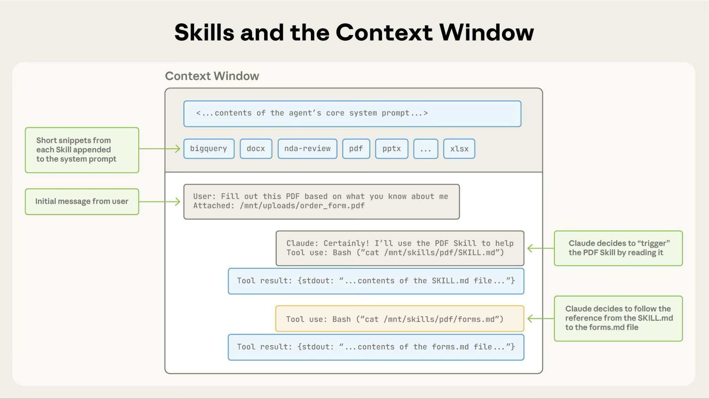
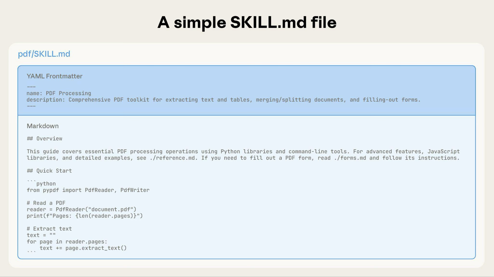
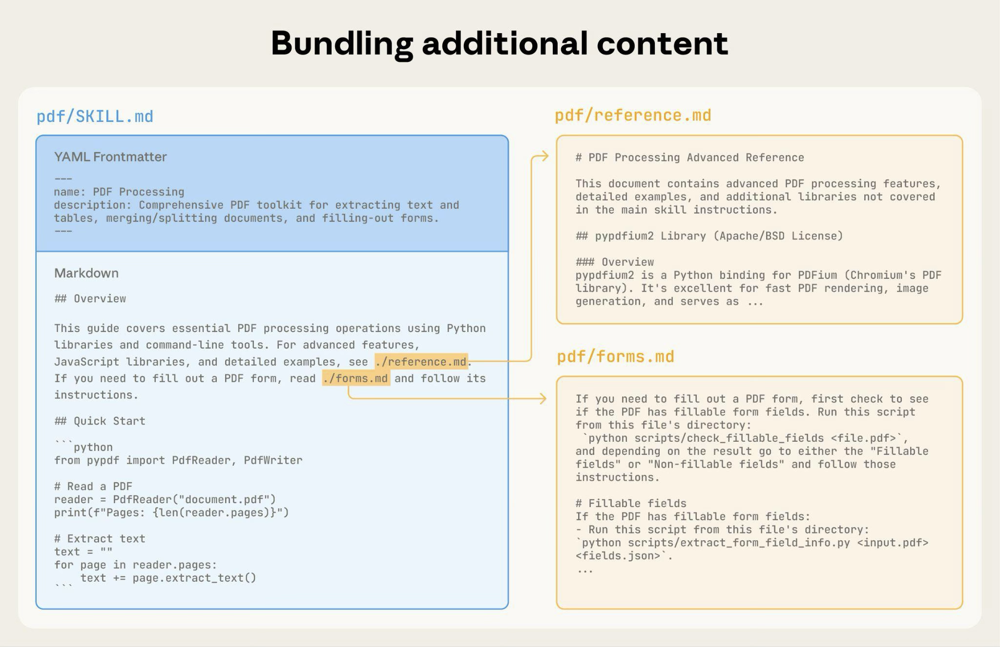
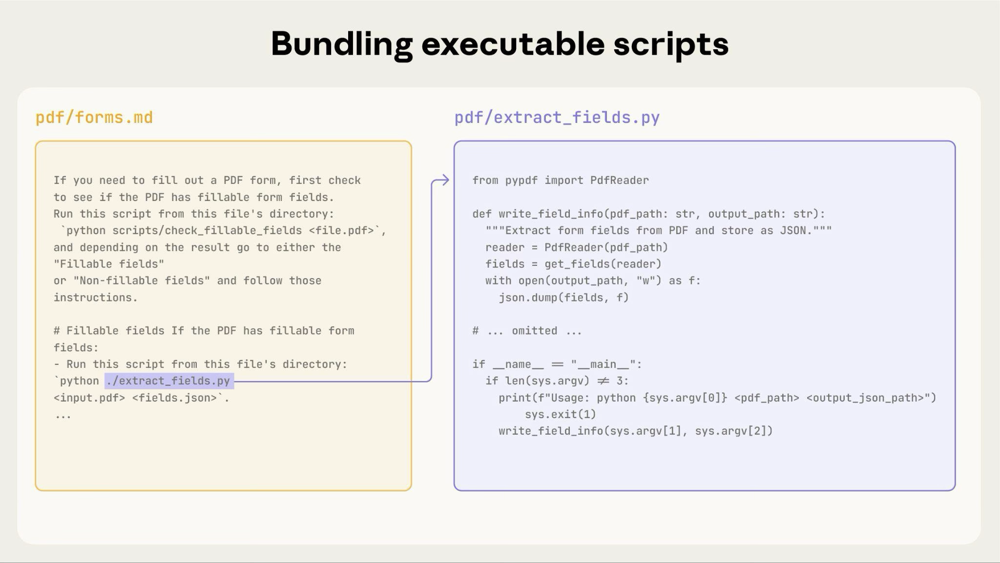

# Skills
Agent Skills 是可扩展的模块化功能，可增强 LLM 的功能。
每个技能都封装了指令、元数据以及可选资源（如脚本、模板），当相关时，LLM 会自动使用这些内容。

---

# Why use Skills  为什么要使用 Skills 呢？
`Skills` 是一种可重复使用的、基于文件系统的资源，它们为 LLM 提供了特定领域的专业能力：各种工作流程、相关背景信息以及最佳实践。
这些要素使得通用型智能体能够转变为具备专业能力的智能体。
与提示词不同（提示词只是用于一次性任务的对话指令），“技能”可以按需加载，从而无需在多次对话中重复提供相同的指导。

主要优势：
- 让 LLM 专精于特定领域：为各领域任务量身定制其功能。
- 减少重复工作：只需创建一次，即可自动使用。
- 组合功能：将各种技能结合起来，从而构建复杂的工作流程。

---

# How Skills work  技能是如何发挥作用的
这些 `SKILLS` 利用了 Claude 的虚拟机环境，从而实现了仅靠提示语无法实现的功能。Claude 在具有文件系统访问功能的虚拟机中运行，因此这些 `SKILLS` 可以被看作是包含各种指令、可执行代码和参考资料的目录结构。这些结构就像是为新成员准备的入门指南一样。

这种基于文件系统的架构实现了**渐进式信息展示**：Claude 会根据需要分阶段加载信息，而不会一次性加载所有信息。


## Three types of Skill content, three levels of loading
三种类型的技能内容，三种不同的加载程度
技能可以包含三种类型的内容，这些内容会在不同的时间被加载进来：

### Level 1: Metadata (always loaded)   第 1 级：元数据（始终被加载）
内容类型：使用说明。该技能的 YAML 元数据中包含了相关说明信息：
```yaml
---
name: pdf-processing
description: Extract text and tables from PDF files, fill forms, merge documents. Use when working with PDF files or when the user mentions PDFs, forms, or document extraction.
---
```
- Claude 在启动时会加载这些元数据，并将其包含在系统提示信息中。
- 这种轻量级的处理方式意味着，你可以轻松安装许多 `SKILLS` ，而不会对系统性能造成影响。
- Claude 只知道每个“技能”的存在以及何时使用它们而已。

### Level 2: Instructions (loaded when triggered)   第 2 级：指令内容（在触发时加载）
内容类型：操作指南。`SKILL.md` 的正文部分包含了各种操作流程、最佳实践以及相关指导信息。
````markdown
# PDF Processing

## Quick start

Use pdfplumber to extract text from PDFs:

```python
import pdfplumber

with pdfplumber.open("document.pdf") as pdf:
    text = p?df.pages[0].extract_text()
```
    
For advanced form filling, see [FORMS.md](FORMS.md).
````

当你请求的内容与某项技能的描述相符时，Claude 会通过 bash 从文件系统中读取 `SKILL.md`文件。只有这样，该内容才会被显示在上下文窗口中。

### Level 3: Resources and code (loaded as needed)  第 3 级：资源和代码（按需加载）
内容类型：使用说明、代码以及各种资源。相关技能还可以包含其他辅助材料。

```text
pdf-skill/
├── SKILL.md (main instructions)
├── FORMS.md (form-filling guide)
├── REFERENCE.md (detailed API reference)
└── scripts/
    └── fill_form.py (utility script)
```
说明：另附有详细指南和工作流程的 Markdown 文件（FORMS.md、REFERENCE.md）

代码：Claude 通过 bash 运行的可执行脚本（fill_form.py、validate.py）。这些脚本能够执行确定的操作，且不会占用额外资源。

资源：各种参考资料，如数据库架构、API 文档、模板以及示例代码等。

Claude 只有在需要时才会访问这些文件。这种文件系统架构意味着，每种内容类型都有其独特的优势：指令类内容适合提供灵活的指导，代码则确保了数据的可靠性，而各种资源则便于用户查询具体信息。

Level  水平/等级 | When Loaded  当已加载时 | Token Cost  代币成本 | Content  内容
--- | --- |------------------| ---
Level 1: Metadata |  始终如此（在启动时）| 每项技能对应 100 个代币   | 来自 YAML 前置信息的 name 和 description
Level 2: Instructions  第 2 级：指令/说明 | 当 `Skill` 被触发时 | 5k 个代币以下 | SKILL.md 文档中包含操作说明与指导内容
Level 3+: Resources  3 | 根据需要/视情况而定 | 实际上相当于无限量/没有限制 | 通过 bash 执行的打包文件，其内容不会被加载到上下文中。

**渐进式展示机制确保了在任何时候，只有相关的内容会显示在界面中。**

### The Skills architecture  技能架构
这些 `skill` 其实运行在代码执行环境中。
Claude 拥有对文件系统的访问权限，能够使用 `bash` 命令来执行各种操作。
可以这样理解：这些 `skill` 就相当于虚拟机上的各个目录，而 Claude 则使用与你在电脑上操作文件时相同的 `bash` 命令来与它们进行交互。


**How Claude accesses Skill content:**

当某个技能被触发时，Claude 会使用 `bash` 命令从文件系统中读取 `SKILL.md` 文件，从而将其中的指令加载到上下文窗口中。
如果这些指令引用了其他文件（比如 `FORMS.md` 或数据库架构文件），Claude 会再使用额外的 `bash` 命令来读取这些文件。
当指令中包含可执行的脚本时，Claude 会通过 `bash` 来运行这些脚本，並仅接收其输出结果；脚本代码本身则不会被加载到上下文窗口中。

**以上架构方式有什么特点？**
**按需访问文件**：Claude 只会读取每项任务所必需的文件。
一个“技能”可能包含数十个参考文件，但如果某项任务只需要销售相关的数据，Claude 只会加载该文件而已。
其余的文件则仍保存在文件系统中，不会占用任何计算资源。

**高效的脚本执行方式**：当 Claude 运行 `validate_form.py` 时，脚本的代码根本不会被加载到上下文窗口中。
只有脚本的输出内容（比如“验证通过”或各种错误信息）才会消耗计算资源。
这样一来，脚本的执行效率远远高于让 Claude 即时生成等效代码的方式。

**打包内容的数量实际上没有限制**：由于文件只有在被访问时才会被使用，
因此“Skills”可以包含详尽的 API 文档、大型数据集、丰富的示例，以及您可能需要的任何参考资料。
那些未被使用的打包内容不会带来任何负面影响。

正是这种基于文件系统的机制，使得“渐进式展示”功能得以实现。
Claude 会像引导你阅读入门指南中的各个章节一样来引导你使用该功能，从而确保你能获取完成每项任务所需的信息。

### 示例：加载 PDF Processing Skill 的过程
以下是 Claude 加载和使用 PDF 处理功能的方式：

1.**开始**：系统提示包括： PDF Processing - Extract text and tables from PDF files, fill forms, merge documents

2.**用户请求**：“请从该 PDF 文件中提取文本并加以总结。”

3.**Claude 调用**： `bash: read pdf-skill/SKILL.md` → 指令已加载到上下文中

4.**Claude 认为**：无需填写表格，因此不会读取 `FORMS.md` 文件。

5.**Claude 执行任务**：根据 `SKILL.md` 中的指令来完成任务。



该图表显示了：

1.系统提示和技能元数据已预加载的默认状态

2.Claude 通过使用 `bash` 命令读取 `SKILL.md` 文件来触发该技能。

3.Claude 会根据需要，选择性地阅读 `FORMS.md` 等附加文件。

4.Claude 继续着手处理这项任务。

5.这种动态加载方式确保了只有相关的技能内容会显示在界面中。

# Where Skills work  技能发挥作用的地方
以下都适合 SKILLS 的使用

## Claude API
Claude API 同时支持预构建的智能体技能和用户自定义的技能。
两者的使用方式完全相同：只需在 `container` 参数中指定相关的 `skill_id` ，再指定代码执行工具即可。

先决条件：通过 API 使用相关功能时，需要三个测试版的头部信息：
- code-execution-2025-08-25 - 技能在代码执行容器中得以应用/实现
- skills-2025-10-02 - 启用技能功能
- files-api-2025-04-14 - 在将文件上传到容器或从容器中下载文件时必不可少。

可以使用预构建的智能体技能，只需引用相应的 `skill_id` 标识即可（例如 `pptx` 、 `xlsx` ）。
也可以通过 `Skills API` 来创建和上传自己的智能体技能（使用 `/v1/skills` 端点）。
自定义的智能体技能可在整个工作空间内共享，所有工作空间成员都可以使用这些技能。

## Claude Code
Claude Code 仅支持自定义技能。

自定义技能：可以将技能以目录形式保存，其中每个目录下都包含 SKILL.md 文件。Claude 会自动识别并使用这些技能。

## Claude.ai
Claude.ai 同时支持预先构建好的智能体技能和用户自定义的技能。

预置的智能体功能：在您创建文档时，这些功能会自动在后台运行。Claude 无需任何额外设置即可使用这些功能。

自定义技能：您可以通过“设置”>“功能”选项，以 ZIP 文件格式上传自己的技能。
该功能适用于 Pro、Max、Team 和 Enterprise 套餐，前提是必须启用代码执行功能。
自定义技能是针对每位用户单独设置的；它们不会在整个组织内共享，也无法由管理员进行集中管理。

---

# Skill structure  技能结构
每项技能都需要一个包含 YAML 格式元数据的 SKILL.md 文件：
```yaml
---
name: your-skill-name
description: Brief description of what this Skill does and when to use it
---

# Your Skill Name

## Instructions 说明
[Clear, step-by-step guidance for Claude to follow]
[清晰、分步的指导，供 Claude 遵循]

## Examples
[Concrete examples of using this Skill]
[使用此技能的具体实例]
```
必填字段： name 和 description

字段要求：

`name`:
- 最多 64 个字符
- 必须只包含小写字母、数字和连字符。
- 不能包含 XML 标签
- 不能包含以下保留字：“anthropic”、“claude”

`description`:
- 必须非空
- 最多 1024 个字符
- 不能包含 XML 标签

`description` 的描述应同时包括该技能的具体功能，以及 Claude 应在何时使用该技能。

---

# Security considerations  安全方面的考虑因素
请仅使用来自可靠来源的 `Skill`：要么是你自己创建的， 要么是从 Anthropic 那里获得的。
这些 `Skill` 通过指令和代码为 Claude 赋予了新的功能。
虽然这让它们非常强大，但同时也意味着，如果某个 `Skill` 具有恶意，
它就有可能引导 Claude 以与该技能的宣称目的不符的方式来使用各种工具或执行代码。

安全注意事项：
- 进行全面审计：检查 `Skill:SKILL.md` 文件中包含的所有内容，包括脚本、图片以及其他资源。 注意那些异常的情况，比如不必要的网络请求、不合常规的文件访问模式，或是与该技能的预期功能不符的操作。
- 外部来源存在风险：那些从外部 `URL` 获取数据的技能尤其危险，因为所获取的内容可能包含恶意指令。即便那些看似可靠的技能，如果其外部依赖项发生变化，也可能会受到威胁。
- 工具的滥用：恶意程序可以利用各种工具来实施有害行为，比如进行文件操作、执行 `bash` 命令或运行代码。
- 数据泄露：那些能够接触敏感数据的人，可能会故意将信息泄露给外部系统。
- 就像安装软件一样来处理：只使用来自可信赖来源的 `Skill`。在将这些 `Skill` 集成到那些需要处理敏感数据或执行关键操作的系统中时，务必格外小心。

# Available Skills  可用技能/具备的技能
## Pre-built Agent Skills  预构建的智能体技能
以下预构建的智能体技能可立即使用：

- PowerPoint（pptx）：用于制作演示文稿、编辑幻灯片以及分析演示内容。
- Excel（xlsx）：用于创建电子表格、分析数据以及生成包含图表的报表。
- Word（docx）：创建文档、编辑内容、设置文本格式
- PDF 格式：能够生成格式规范的 PDF 文档和报告。

## Open-source Skills  开源技能
Anthropic 还在其技能存储库中发布了开源的技能模块：
- Claude API：为 Claude 提供了 8 种编程语言的最新 API 参考资料、SDK 文档以及最佳实践指南。该 API 与 Claude Code 一起提供，也可以从技能库中单独下载安装。

## Custom Skills examples  自定义技能的示例
https://platform.claude.com/cookbook/skills-notebooks-01-skills-introduction

## Data retention  数据保留
“Agent Skills”并不在 ZDR 协议的覆盖范围内。各项技能的详细信息及相关数据均按照 Anthropic 的标准数据保留政策进行存储和处理。

## Limitations and constraints  限制与约束条件
了解这些限制有助于你更有效地规划技能的部署方式。

### Cross-surface availability  跨表面可用性
自定义技能不会在不同设备之间同步。在一个设备上上传的技能，不会自动出现在其他设备上。

- 上传到 Claude.ai 的技能必须单独上传到 API 中。
- 通过 API 上传的技能在 Claude.ai 上无法使用。
- Claude Code 的技能基于文件系统，与 claude.ai 及 API 完全独立。 

你需要为每个想要使用该功能的界面，分别进行管理和上传相关设置。

### Sharing scope  共享范围
根据使用场景的不同，各种技能的共享方式也各不相同：

- Claude.ai：仅限个人用户使用；每位团队成员必须单独上传。
- Claude API：适用于整个工作空间；所有工作空间成员都可以使用已上传的智能体。
- Claude Code：可以是个人使用的版本（ `~/.claude/skills/` ），也可以是用于特定项目的版本（ `.claude/skills/` ）；此外，还可以通过 Claude Code 插件来共享代码。

Claude.ai 不支持集中式管理功能，也无法在整个组织范围内部署自定义的智能体。

### Runtime environment constraints     运行时环境限制
你的技能所能够使用的具体运行环境，取决于你使用该技能的产品平台或界面。

- claude.ai:
  - 不同的网络访问权限：根据用户/管理员的设置，Skills 可能拥有完全的网络访问权限、部分网络访问权限，或者完全没有网络访问权限。详情请参阅“创建和编辑文件”相关帮助文档。
- Claude API:
  - 无网络连接：该技能无法调用外部 API 或访问互联网。
  - 无需安装任何运行时包：系统中只有预先安装好的包可用。在程序执行过程中，无法安装新的包。
  - 仅包含预配置的依赖项：请查阅代码执行工具的文档，了解可用软件包的列表。
- Claude Code:
  - 完全的网络访问权限：这些程序拥有与用户电脑上其他程序相同的网络访问权限。
  - 不建议进行全局包安装：为了不影响用户的电脑使用，应仅在本地安装各个软件包。

请根据这些限制条件来规划自己的技能发展。

# Skill authoring best practices  技能创作的最佳实践

优秀的“技能”应当结构清晰、条理分明，并经过实际使用中的检验。

# Core principles  核心原则

## Concise is key  简洁为上策
上下文是一种公共资源，技能的描述和指令应当简洁明了，避免冗长和复杂的语言。

skill 将会与该上下文窗口所有信息共享给 LLM
- 系统提示 system prompt
- 对话记录 Conversation history
- 其它技能的元数据 Other Skills' metadata
- 用户实际请求 User's actual request

并非每个定义的 `Skill` 都会产生 `token` 损耗。在启动时，系统只会预先加载所有 `Skill` 的元数据，比如名称和描述。
只有当某个 `Skill` 被需要时，Claude 才会读取该技能相关的 `SKILL.md` 文件，其他文件则会在必要时再被读取。
不过，`SKILL.md` 中的内容最好简洁明了：一旦 Claude 加载了该文件，
该 `SKILL.md` 的包含的 `skill` 的信息都会被加载到上下文窗口中，并与其他信息共享，从而产生 `token` 损耗。

假设使用的 LLM 比较聪明

这时候，只需要补充一些背景信息，思考以下问题再对 `Skill` 进行描述：
- LLM 真的需要这样的解释吗？
- 我能认为 LLM 知道这件事吗？
- 这段文字真的值得付出这么高的成本来呈现吗？

**好例子（简洁明了，控制在 50 个词左右）**
````markdown
## Extract PDF text

Use pdfplumber for text extraction:

```python
import pdfplumber

with pdfplumber.open("file.pdf") as pdf:
    text = pdf.pages[0].extract_text()
```

````

**不好的例子（过于冗长（大约 150 个字符））**
```markdown
## Extract PDF text

PDF (Portable Document Format) files are a common file format that contains
text, images, and other content. To extract text from a PDF, you'll need to
use a library. There are many libraries available for PDF processing, but
pdfplumber is recommended because it's easy to use and handles most cases well.
First, you'll need to install it using pip. Then you can use the code below...
```

> 注：简洁的例子是基于 LLM 已经明白 pdf 文件是什么，以及 pdfplumber 是什么的前提下的。

## Set appropriate degrees of freedom   设定适当的自由度

请使具体的要求与任务的复杂程度和可变性相称。

**高度自由度（基于文本的指令）：**

适用场景：
- 多种方法都是可行的。
- 决策需视具体情况而定。
- 启发式方法指导着这一处理方式。

示例：
```text
## Code review process

1. Analyze the code structure and organization
2. Check for potential bugs or edge cases
3. Suggest improvements for readability and maintainability
4. Verify adherence to project conventions

代码评审流程
1. 分析代码结构和组织
2. 检查潜在的错误或边界情况
3. 建议改进可读性和可维护性
4. 验证是否遵守项目规范
```

**中等自由度（带参数的伪代码或脚本）：**

适用场景：
- 存在一种更理想的模式/更优的解决方案。
- 稍微有些差异也是可以接受的。
- 配置会影响到其行为表现。

示例：
````markdown
## Generate report

Use this template and customize as needed:

```python
def generate_report(data, format="markdown", include_charts=True):
    # Process data
    # Generate output in specified format
    # Optionally include visualizations
```

````

**自由度低（有固定的脚本格式，参数很少或根本没有）：**

适用场景：
- 各项操作都十分脆弱，容易出错。
- 一致性至关重要。
- 必须遵循特定的顺序。

示例：
````markdown
## Database migration

Run exactly this script:

```bash
python scripts/migrate.py --verify --backup
```

Do not modify the command or add additional flags.
````

## Test with all models you plan to use   对所有你打算使用的模型进行测试。
技能相当于对模型的补充，因此其效果取决于底层模型本身。所以需要对使用的模型进行测试。

按模型分类的测试注意事项：
- Claude Haiku (fast, economical): 该技能是否提供了足够的指导呢？
- Claude Sonnet (balanced): 这项技能是否简洁高效呢？
- Claude Opus (powerful reasoning): 该技能是否避免了过度解释？

参考以上方式测试自定义的模型也可

---

# Skill structure  技能结构

> ❕YAML 前置信息：SKILL.md 文件的前置信息需要包含两个字段：
> 
> `name`:
> 
> - 最多 64 个字符
> - 必须只包含小写字母、数字和连字符。
> - 不能包含 XML 标签
> - 不能包含以下保留字：“anthropic”、“claude”
>
>`description`:
> - 必须非空
> - 最多 1024 个字符
> - 不能包含 XML 标签
> - 应说明该技能的功能以及何时使用它。

## Naming conventions  命名规则/命名惯例
请使用统一的命名规则，以便于理解和讨论各项技能。

建议使用**动名词**形式来命名技能，因为这种方式能够清晰地体现该技能所对应的功能或能力。

`name` 字段只能包含小写字母、数字和连字符。

最佳命名方案（动名词形式）：
- `processing-pdfs`
- `analyzing-spreadsheets`
- `managing-databases`
- `testing-code`
- `writing-documentation`

可接受的替代方案：
- 名词短语： `pdf-processing` 、 `spreadsheet-analysis`
- 注重行动： `process-pdfs` 、 `analyze-spreadsheets`

避免：
- 模糊的名称： `helper` 、 `utils` 、 `tools`
- 过于通用了： `documents` 、 `data` 、 `files`
- 保留字： `anthropic-helper` 、 `claude-tools`
- 你的技能组合中存在不一致性/你的技能组合缺乏连贯性

一致的命名方式有助于：
- 在文档编写和对话中运用参考资料的相关技能
- 一眼就能明白某项技能的用途/功能是什么
- 整理并搜索各种技能信息
- 保持专业且结构合理的技能库。

## Writing effective descriptions   撰写有效的描述文字
`description` 字段有助于技能的识别与使用。该字段应同时说明该技能的功能以及使用该技能的时机。

> ⚠️ 始终使用第三人称描述。这些描述会被输入到系统提示中，如果视角不一致，就会导致各种问题
> 
> 好例子：“能够处理 Excel 文件并生成报告”
> 
> 避免说：“我可以帮你处理 Excel 文件”
> 
> 避免使用这样的表述：“你可以用这个来处理 Excel 文件”

具体说明，并列出相关关键词。既要描述该技能的功能，也要说明在什么情况下/触发条件下使用该技能。

每个技能都只有一个描述字段。
这个描述对于技能的选择非常重要：Claude 会利用这个描述来从 100 多种可用技能中选出合适的技能。
你的描述必须足够详细，以便 Claude 能够判断何时使用该技能。而 `SKILL.md` 文件则包含了该技能的具体实现细节。

合适的例子：
```text pdf-processing
description: Extract text and tables from PDF files, fill forms, merge documents. Use when working with PDF files or when the user mentions PDFs, forms, or document extraction.

description：从PDF文件中提取文本和表格，填写表单，合并文档。适用于处理PDF文件或用户提到PDF、表单或文档提取时使用。
```

```text excel-analysis
description: Analyze Excel spreadsheets, create pivot tables, generate charts. Use when analyzing Excel files, spreadsheets, tabular data, or .xlsx files.

description：分析Excel表格，创建数据透视表，生成图表。适用于分析Excel文件、电子表格、表格数据或.xlsx文件。
```

```text git-commit-helper
description: Generate descriptive commit messages by analyzing git diffs. Use when the user asks for help writing commit messages or reviewing staged changes.

description：通过分析 Git 差异文件生成描述性的提交信息。当用户需要帮助编写提交信息或审阅已暂存的更改时使用。
```

避免使用此类含糊不清的描述：
```text
description: Helps with documents
```

```text
description: Processes data
```

```text
description: Does stuff with files
```

## Progressive disclosure patterns    渐进式披露模式
`SKILL.md` 起到了概要说明的作用：它会根据需要，将用户引导至相关的详细资料页面，就像入门指南中的目录一样。

使用指南：
- 为确保最佳性能，请将 `SKILL.md` 文档的内容长度控制在 500 行以内。
- 当接近此限制时，应将内容拆分成多个独立的文件。
- 利用下面的模板，可以有效整理各种说明、代码和资源。

### Visual overview: From simple to complex   视觉概览：从简单到复杂
一个基本的技能，最初只需要一个包含元数据和说明的 SKILL.md 文件即可。

 

随着技能水平和需求的提升，慢慢的内容会越来越多



完整的技能目录结构可能如下所示：
```text
pdf/
├── SKILL.md              # Main instructions (loaded when triggered)
├── FORMS.md              # Form-filling guide (loaded as needed)
├── reference.md          # API reference (loaded as needed)
├── examples.md           # Usage examples (loaded as needed)
└── scripts/
    ├── analyze_form.py   # Utility script (executed, not loaded)
    ├── fill_form.py      # Form filling script
    └── validate.py       # Validation script
```

### Pattern 1: High-level guide with references   模式 1：包含参考资料的高层次指南
````markdown
---
name: pdf-processing
description: Extracts text and tables from PDF files, fills forms, and merges documents. Use when working with PDF files or when the user mentions PDFs, forms, or document extraction.
---

# PDF Processing

## Quick start

Extract text with pdfplumber:
```python
import pdfplumber
with pdfplumber.open("file.pdf") as pdf:
    text = pdf.pages[0].extract_text()
```

## Advanced features

**Form filling**: See [FORMS.md](FORMS.md) for complete guide
**API reference**: See [REFERENCE.md](REFERENCE.md) for all methods
**Examples**: See [EXAMPLES.md](EXAMPLES.md) for common patterns
````

通过以上文件，LLM 仅在需要时才会加载 FORMS.md、REFERENCE.md 或 EXAMPLES.md 文件。

### Pattern 2: Domain-specific organization   模式 2：特定领域的组织结构

对于涉及多个领域的技能，应按照不同领域来组织相关内容，从而避免加载不必要的信息。
当用户询问与销售相关的指标时，Claude 只需读取与销售相关的信息，而无需处理财务或市场营销方面的数据。
这样一来，既能有效控制 `Token` 的使用量，又能确保处理的信息与用户的需求紧密相关。

```text
bigquery-skill/
├── SKILL.md (overview and navigation)
└── reference/
    ├── finance.md (revenue, billing metrics)
    ├── sales.md (opportunities, pipeline)
    ├── product.md (API usage, features)
    └── marketing.md (campaigns, attribution)
```

````markdown SKILL.md
# BigQuery Data Analysis

## Available datasets

**Finance**: Revenue, ARR, billing → See [reference/finance.md](reference/finance.md)
**Sales**: Opportunities, pipeline, accounts → See [reference/sales.md](reference/sales.md)
**Product**: API usage, <fea></fea>tures, adoption → See [reference/product.md](reference/product.md)
**Marketing**: Campaigns, attribution, email → See [reference/marketing.md](reference/marketing.md)

## Quick search

Find specific metrics using grep:

```bash
grep -i "revenue" reference/finance.md
grep -i "pipeline" reference/sales.md
grep -i "api usage" reference/product.md
```
````

### Pattern 3: Conditional details    模式 3：有条件的详细信息/需满足条件的详细内容
显示基本内容，同时提供通往高级内容的链接：

```markdown
# DOCX Processing

## Creating documents

Use docx-js for new documents. See [DOCX-JS.md](DOCX-JS.md).

## Editing documents

For simple edits, modify the XML directly.

**For tracked changes**: See [REDLINING.md](REDLINING.md)
**For OOXML details**: See [OOXML.md](OOXML.md)
```

只有当用户需要这些功能时，Claude 才会读取 REDLINING.md 或 OOXML.md 文件。

## Avoid deeply nested references   避免使用过于复杂的嵌套引用结构
当某个文件被其他文件引用时，Claude 可能会部分地读取该文件的内容。
在遇到嵌套引用时，Claude 可能会使用 `head -100` 之类的指令来预览文件内容，而不会完整地读取整个文件。这样一来，获取到的信息就不完整了。

请确保所有参考文件都位于 `SKILL.md` 的同一层级。
所有参考文件都应直接从 `SKILL.md` 中链接过来，这样 Claude 在需要时就能读取到完整的文件内容。

糟糕的例子：过于复杂/难以理解。
```markdown
# SKILL.md
See [advanced.md](advanced.md)...

# advanced.md
See [details.md](details.md)...

# details.md
Here's the actual information...
```

以上问题：多层嵌套。当 Claude 需要访问 `details.md` 文件时，它需要先读取 `SKILL.md` 文件，然后再读取 `advanced.md` 文件，最后才会访问 `details.md` 文件。

浅一层结构 One level deep:
```markdown
# SKILL.md

**Basic usage**: [instructions in SKILL.md]
**Advanced features**: See [advanced.md](advanced.md)
**API reference**: See [reference.md](reference.md)
**Examples**: See [examples.md](examples.md)
```

解决了什么问题：所有文件都直接链接到 `SKILL.md` 文件中。当 Claude 需要访问 `advanced.md` 文件时，它只需从 `SKILL.md` 文件中读取该文件的链接即可。
这样一来，Claude 就能直接访问 `advanced.md` 文件，而不需要先访问其他文件了。

## Structure longer reference files with table of contents    为较长的参考文件添加目录结构
对于长度超过 100 行的参考文件，请在顶部添加目录。这样，即使 Claude 只能部分读取文件内容，也能了解文件的全部信息。

示例：
```markdown
# API Reference

## Contents
- Authentication and setup
- Core methods (create, read, update, delete)
- Advanced features (batch operations, webhooks)
- Error handling patterns
- Code examples

## Authentication and setup
...

## Core methods
...

## Advanced features
...

## Error handling patterns
...

## Code examples
...
```

Claude 可以阅读整个文件，也可以根据需要跳转到特定的部分。

# Workflows and feedback loops  工作流程与反馈机制

## Use workflows for complex tasks  利用工作流来处理复杂的任务。

将复杂的操作拆分成清晰、有序的步骤。对于特别复杂的工作流程，可以提供一份检查清单，让 Claude 在处理过程中逐项勾选完成情况。

**示例 1（针对“无需编程的技能”的研究综合流程）**：
````markdown
## 研究综述工作流程

复制此清单并跟踪您的进度：

```
研究进展：  
- [ ] 第一步：阅读所有原始资料  
- [ ] 第二步：确定关键主题  
- [ ] 第三步：交叉核对主张内容  
- [ ] 第四步：撰写结构化摘要  
- [ ] 第五步：核实引用信息
```

**第一步：阅读所有原始文件**

检查 `sources/` 目录中的每个文档，注意其中的主要论点和支持证据。

**第二步：确定关键主题**

在不同来源中寻找共同的模式。哪些主题反复出现？哪些来源之间存在一致或不一致？

**第三步：交叉核对声明**

对于每个主要论点，核实其是否出现在原始资料中，并注明支持每一点的来源。

**第4步：创建结构化摘要**

按主题组织发现内容。包括：
- 主要论点
- 来源中的支持性证据
- 相互矛盾的观点（如有）

**第5步：验证引用**

检查每项声明是否引用了正确的原始文件。如果引用不完整，请返回第3步。
````

该例子展示了工作流如何应用于那些不需要编写代码的分析任务中。清单模式适用于各种复杂的多步骤流程。

**示例 2：PDF 表格填写工作流程（适用于需要编写代码的技能相关任务）**：

````markdown
## PDF 表单填写工作流程

复制此清单，并在完成项目时勾选相应项目：

```
任务进度：  
- [ ] 第一步：分析表单（运行 analyze_form.py）  
- [ ] 第二步：创建字段映射（编辑 fields.json）  
- [ ] 第三步：验证映射（运行 validate_fields.py）  
- [ ] 第四步：填充表单（运行 fill_form.py）  
- [ ] 第五步：验证输出（运行 verify_output.py）
```

**第一步：分析表单**

运行：`python scripts/analyze_form.py input.pdf`

提取表单字段及其位置，并保存到 `fields.json`。

**步骤2：创建字段映射**

编辑 `fields.json` 文件，为每个字段添加值。

**第三步：验证映射**

运行：`python scripts/validate_fields.py fields.json`

在继续之前，请修复所有验证错误。

**第4步：填写表格**

运行：`python scripts/fill_form.py input.pdf fields.json output.pdf`

**第5步：验证输出**

运行：`python scripts/verify_output.py output.pdf`

如果验证失败，请返回步骤2。
````

## Implement feedback loops  实施反馈机制/建立反馈循环

常见流程：运行验证工具 → 修正错误 → 重复上述步骤

这种模式大大提升了输出质量。

**示例 1：风格指南的遵守情况（适用于无需编写代码的技能）：**
```markdown
## 内容审核流程

1. 请按照 STYLE_GUIDE.md 中的指南撰写内容。
2. 对照检查清单进行审核：
- 检查术语一致性
- 验证示例符合标准格式
- 确认所有必需部分均已包含
3. 如发现问题：
- 请注明每个问题并附上具体章节参考
- 修改内容
- 再次检查清单
4. 只有在满足所有要求后才能继续
5. 完成并保存文档
```

该示例展示了如何利用参考文档而非脚本来实现验证流程。这里的“验证工具”就是 STYLE_GUIDE.md 文件，Claude 通过读取并对比该文件来进行验证操作。

**示例 2：文档编辑流程（适用于涉及编程的技能）：**
```markdown
## 文档编辑流程
1. 请对 `word/document.xml` 进行编辑
2. **立即验证**：`python ooxml/scripts/validate.py unpacked_dir/`
3. 如果验证失败：
- 仔细查看错误信息
- 修复XML中的问题
- 再次运行验证
4. **仅在验证通过后才进行**
5. 重建：`python ooxml/scripts/pack.py unpacked_dir/ output.docx`
6. 测试输出文档
```

---

# Content guidelines  内容准则/内容指导方针

## Avoid time-sensitive information   避免包含时效性强的信息
请不要包含那些会过时的信息：

示例：对时间敏感的信息（会随时间而变得不正确）：
```text
If you're doing this before August 2025, use the old API.
After August 2025, use the new API.
```

正确示例（适用于 'old patterns' 这一部分）：
```text
## Current method

Use the v2 API endpoint: `api.example.com/v2/messages`

## Old patterns

<details>
<summary>Legacy v1 API (deprecated 2025-08)</summary>

The v1 API used: `api.example.com/v1/messages`

This endpoint is no longer supported.
</details>
```

这种方式在提供旧背景信息的同时不会影响主要内容

## Use consistent terminology   请使用一致的术语。

选择一个术语，并在整个技能描述中始终使用该术语：

正确示例：
- Always "API endpoint" 始终选择“API 端点”
- Always "field"  始终处于“现场”状态
- Always "extract"  始终要“提取”出来。

错误示例（不一致，混用）：
- Mix "API endpoint", "URL", "API route", "path"
- Mix "field", "box", "element", "control"
- Mix "extract", "pull", "get", "retrieve"

一致性有助于 Claude 理解和使用技能

# Common patterns  常见模式/典型模式

## Template pattern  模板模式

提供用于输出格式的模板。可根据您的需求调整其严格程度。

对于有严格要求的情况（比如 API 响应或数据格式方面）：

````markdown
## Report structure

ALWAYS use this exact template structure:

```markdown
# [Analysis Title]

## Executive summary
[One-paragraph overview of key findings]

## Key findings
- Finding 1 with supporting data
- Finding 2 with supporting data
- Finding 3 with supporting data

## Recommendations
1. Specific actionable recommendation
2. Specific actionable recommendation
```

## 报告结构

始终使用以下精确的模板结构：

```markdown
# [分析标题]

## 执行摘要
[对主要发现的一段概述]
- 发现1，附有支持数据  
- 发现2，附有支持数据  
- 发现3，附有支持数据

## 推荐
1. 具体可操作的建议
2. 具体可操作的建议
```
````

灵活调整：对于那些需要一定程度的灵活性的情况，可以提供一个更宽松的模板：

````markdown
## Report structure

Here is a sensible default format, but use your best judgment based on the analysis:

```markdown
# [Analysis Title]

## Executive summary
[Overview]

## Key findings
[Adapt sections based on what you discover]

## Recommendations
[Tailor to the specific context]
```

Adjust sections as needed for the specific analysis type.

## 报告结构

这是一个合理的默认格式，但请根据分析结果自行判断使用：

```markdown
# [分析标题]

## 摘要
[概述]

## 主要发现
[根据你的发现调整各部分]

## 推荐
[根据具体情境量身定制]
```

根据具体分析类型调整相应部分。
````

## Examples pattern  示例模式/范例格式

对于那些输出质量取决于能否查看示例的技能，应像在常规提示中那样，提供输入/输出对。

````markdown
## Commit message format

Generate commit messages following these examples:

**Example 1:**
Input: Added user authentication with JWT tokens
Output:
```
feat(auth): implement JWT-based authentication

Add login endpoint and token validation middleware
```

**Example 2:**
Input: Fixed bug where dates displayed incorrectly in reports
Output:
```
fix(reports): correct date formatting in timezone conversion

Use UTC timestamps consistently across report generation
```

**Example 3:**
Input: Updated dependencies and refactored error handling
Output:
```
chore: update dependencies and refactor error handling

- Upgrade lodash to 4.17.21
- Standardize error response format across endpoints
```

Follow this style: type(scope): brief description, then detailed explanation.
````

提供示例能让 Claude 更好地理解预期的输出格式和风格，从而提高输出质量。

## Conditional workflow pattern   条件式工作流模式

在各个决策节点上为 Claude 提供指导：
```markdown
## Document modification workflow

1. Determine the modification type:

   **Creating new content?** → Follow "Creation workflow" below
   **Editing existing content?** → Follow "Editing workflow" below

2. Creation workflow:
   - Use docx-js library
   - Build document from scratch
   - Export to .docx format

3. Editing workflow:
   - Unpack existing document
   - Modify XML directly
   - Validate after each change
   - Repack when complete
```

> 如果工作流程过于复杂，包含太多步骤，可以考虑将各个步骤分别保存在不同的文件中。然后让 Claude 根据当前的任务来读取相应的文件。

# Evaluation and iteration  评估与迭代

## Build evaluations first  先进行构建评估。

在编写详细的文档之前，先进行评估。这样可以确保你所开发的解决方案确实能解决实际问题，而不是用来记录那些凭空想象出来的问题。

**以评估为导向的开发：**
- **找出不足之处**：让 Claude 在没有使用任何 `Skill` 的情况下，去处理一些典型的任务。记录下所有出现的错误或因缺乏必要上下文而导致的处理失败情况。
- **进行评估**：设计三种情景来检验这些不足之处。
- **建立基准**：在不使用 `Skill` 的情况下，测量 Claude 的性能。
- **只需编写最必要的说明**：只需提供足以弥补不足、并通过评估的内容即可。
- **迭代过程**：执行各项评估，与基准值进行比较，然后进行优化调整。

这种方法能确保你解决的是真正存在的问题，而不是那些可能永远无法实现的预期需求。

**评估体系：**
```json
{
  "skills": ["pdf-processing"],
  "query": "从该PDF文件中提取所有文本，并保存到output.txt",
  "files": ["test-files/document.pdf"],
  "expected_behavior": [
    "使用适当的PDF处理库或命令行工具成功读取PDF文件",
    "从文档的所有页面中提取文本内容，且不遗漏任何页面",
    "将提取的文本以清晰、易读的格式保存到名为output.txt的文件中"
  ]
}
```
该示例展示了如何利用简单的评估标准来进行基于数据的评估。

## Develop Skills iteratively with Claude   利用 Claude 不断迭代地提升各项技能

最有效的技能开发流程需要借助 Claude 本身来完成。
首先，利用一个 Claude 实例（“Claude A”）来创建某个技能，然后再让其他 Claude 实例（“Claude B”）使用这个技能。
Claude A 负责协助设计和完善相关指令，而 Claude B 则负责在实际任务中测试这些指令的有效性。
这一方法之所以有效，是因为 Claude 能够理解如何编写有效的指令，同时也清楚智能体需要哪些信息。

**创建新技能：**

1. **在不使用任何特殊技能的情况下完成任务**：使用常规的提示语与 Claude A 一起解决问题。在解决问题的过程中，你会自然而然地提供相关背景信息、解释自己的偏好，并分享相关的操作步骤。注意一下，你反复提到了哪些信息。

2. **识别可重复使用的模式**：在完成任务后，思考自己所提供过的哪些条件或信息对将来处理类似任务会有用处。

   **例如**：如果您使用了 BigQuery 进行数据分析，那么您可能需要提供表格名称、字段定义、过滤规则（比如“始终排除测试账户”），以及常见的查询模式。
3. 请 Claude A 创建一个技能：“创建一个能够复制我们刚刚使用的 BigQuery 分析模式的技能。该技能应包含表格结构、命名规则，以及关于如何过滤测试账户的规则。”
   > Claude 能够自然地理解“技能”的格式和结构。你无需使用任何特殊的系统提示或“写作技能”相关的功能，就能让 Claude 帮助你创建“技能”。只需让 Claude 来创建一个“技能”即可，它就会自动生成结构完整的 SKILL.md 文件，其中包含必要的前置信息和正文内容。
4. **简洁性审查**：检查 Claude A 是否添加了不必要的解释。可以这样提问：“请去掉关于‘胜率’含义的说明——Claude 本来就明白这个概念。”
5. **优化信息结构**：让 Claude A 更有效地整理内容。例如：“请把内容整理好，让表格结构单独保存在参考文件中。以后我们还可以再添加更多的表格。”
6. **在类似任务上的测试**：在相关的使用场景中，使用 Claude B 来执行该技能。观察 Claude B 是否能够找到正确的信息、正确应用相关规则，并成功完成任务。
7. **根据观察结果进行迭代**：如果 Claude B 在处理某项任务时遇到困难或出错，那就把具体问题反馈给 Claude A：“当 Claude 使用该功能时，它忘记了按季度来筛选数据。我们是否需要添加一个关于日期筛选规则的章节呢？”

**对现有技能进行迭代：**

在提升技能时，也遵循着同样的层级结构。其过程表现为：交替进行……
- **与 Claude A 合作**（他是一位致力于提升该技能水平的专家）
- **使用 Claude B 进行测试**（该智能体利用所拥有的技能来执行实际任务）
- **观察 Claude B 的行为**，并将观察结果反馈给 Claude A。
- **在实际工作中运用该技能**：给已加载了该技能的 Claude B 分配实际任务，而非测试用例。
- **观察 Claude B 的行为**：注意他在哪些方面遇到了困难、取得了成功，或者做出了出人意料的决策。

  **示例观察**：“当我向 Claude B 请求区域销售报告时，系统虽然执行了查询操作，但却忘了过滤掉测试账户。而该系统明明有相关规则来处理这种情况。”
- **如需改进，请联系 Claude A**：请分享当前的 SKILL.md 文件，并描述您所观察到的问题。同时请提出以下问题：“我注意到，当我请求生成区域报告时，Claude B 忘记了过滤测试账户。虽然该技能文档中提到了过滤操作，但可能表述得不够清晰。”
- **请查看 Claude A 的建议**：Claude A 建议对内容进行重新整理，让各项规则更显眼一些。例如，可以用“必须过滤”这样的措辞来替代“始终过滤”，同时也可以重新调整工作流程部分的结构。
- **应用并测试更改**：根据 Claude A 的改进意见对相关功能进行更新，然后使用 Claude B 在类似的请求上再次进行测试。
- **根据使用情况重复上述流程**：每当遇到新的场景时，都重复“观察-改进-测试”的循环。每次迭代都是基于智能体的实际行为来改进其性能，而非基于各种假设。

**收集团队反馈**：
1. 与队友分享技能，并观察他们如何使用这些技能。
2. 请询问：该技能是否能在预期的情况下被激活？操作说明是否清晰易懂？还有哪些不足之处？
3. 结合反馈意见，以弥补自己在使用方式上的不足之处。

这种方法的优点在于：Claude A 能够理解智能体的需求，而你则提供相关领域的专业知识。
Claude B 则通过实际使用情况来揭示其中的不足之处。
通过不断的迭代优化，各项能力都能根据实际表现来提升，而非基于某种假设。

## Observe how Claude navigates Skills  看看克劳德是如何运用各种技能的吧。
在不断改进各项技能的过程中，要注意 Claude 在实际使用中是如何运用这些技能的。请留意以下几点：

- 意想不到的探索路径：Claude 是否按照你意想不到的顺序来读取文件？这可能意味着你的文件结构并不像你想象的那么直观。
- 链接错误：克劳德是否没有注意到那些指向重要文件的链接呢？或许，你需要把那些链接标注得更清楚、更显眼一些。
- 过度依赖某些部分：如果 Claude 反复读取同一个文件，那么应该考虑是否将该内容放入主要的 SKILL.md 文件中。
- 被忽略的内容：如果 Claude 从未访问过某个被打包在一起的文件，那么在主要说明中提及该文件可能是不必要的，或者表述方式不够恰当。

应基于这些观察结果来迭代改进，而非凭空假设。在技能的元数据中， `name` 和 `description` 尤为重要。
Claude 会依据这些信息来决定是否根据当前任务来触发该技能。请确保这些描述能够清晰地说明该技能的功能以及适用场景。

# Anti-patterns to avoid  应避免的反模式/不良实践

## Avoid Windows-style paths 避免使用 Windows 风格的路径格式。
无论在什么操作系统下，文件路径中都应使用正斜杠：

- ✓ 很好： scripts/helper.py 、 reference/guide.md
- ✗ 应避免使用： scripts\helper.py 、 reference\guide.md

类 Unix 的路径格式在所有平台上都能正常使用，而类 Windows 的路径格式则在 Unix 系统上会导致错误。

## Avoid offering too many options  避免提供过多的选择选项。

除非有必要，否则不要提出多种解决方案。

````markdown
**Bad example: Too many choices** (confusing):
"You can use pypdf, or pdfplumber, or PyMuPDF, or pdf2image, or..."

**Good example: Provide a default** (with escape hatch):
"Use pdfplumber for text extraction:
```python
import pdfplumber
```

For scanned PDFs requiring OCR, use pdf2image with pytesseract instead."
````

---

# Advanced: Skills with executable code 高级：能够编写可执行代码的技能
以下内容主要介绍那些包含可执行脚本的技能。

## Solve, don't punt  解决问题，不要逃避。

在为 `Skills` 编写脚本时，应自行处理各种错误情况，而不是将问题推给 Claude 来处理。

**好的例子：明确处理错误：**
```python
def process_file(path):
    """Process a file, creating it if it doesn't exist."""
    try:
        with open(path) as f:
            return f.read()
    except FileNotFoundError:
        # Create file with default content instead of failing
        print(f"File {path} not found, creating default")
        with open(path, "w") as f:
            f.write("")
        return ""
    except PermissionError:
        # Provide alternative instead of failing
        print(f"Cannot access {path}, using default")
        return ""
```

**糟糕的例子：把球传给 LLM 吧。**
```python
def process_file(path):
    # Just fail and let Claude figure it out
    return open(path).read()
```

配置参数也必须经过合理的设定和记录

正确例子：
```properties
# HTTP requests typically complete within 30 seconds
# Longer timeout accounts for slow connections
REQUEST_TIMEOUT = 30

# Three retries balances reliability vs speed
# Most intermittent failures resolve by the second retry
MAX_RETRIES = 3
```

错误例子：
```properties
TIMEOUT = 47  # Why 47?
RETRIES = 5  # Why 5?
```

## Provide utility scripts  提供实用脚本  
即使 LLM 能够自动生成脚本，但是现成的脚本可以节省时间并减少错误。提供一些实用的脚本来处理常见的任务或验证输出。
- 比自动生成的代码更可靠
- 保存令牌（无需在代码中额外添加相关代码）
- 节省时间（无需生成代码）
- 确保在各种使用场景下的一致性



上图展示了可执行脚本与指令文件是如何协同工作的。指令文件（forms.md）会引用该脚本，而 Claude 无需将脚本的内容加载到内存中即可将其执行。

重要提示：请在说明中明确指出，Claude 应该执行哪一项操作：
- 执行脚本（最常见的方式）：“运行 analyze_form.py 以提取字段”
- 如需了解复杂的逻辑实现方式，请参考以下内容：“关于字段提取算法的详细信息，请参阅 analyze_form.py ”。

对于大多数实用脚本来说，执行方式更为可靠且高效。

示例：
````markdown
## Utility scripts

**analyze_form.py**: Extract all form fields from PDF

```bash
python scripts/analyze_form.py input.pdf > fields.json
```

Output format:
```json
{
  "field_name": {"type": "text", "x": 100, "y": 200},
  "signature": {"type": "sig", "x": 150, "y": 500}
}
```

**validate_boxes.py**: Check for overlapping bounding boxes

```bash
python scripts/validate_boxes.py fields.json
# Returns: "OK" or lists conflicts
```

**fill_form.py**: Apply field values to PDF

```bash
python scripts/fill_form.py input.pdf fields.json output.pdf
```
````

## Use visual analysis  运用视觉分析手段
当输入内容可以以图像形式呈现时，让 Claude 来分析这些图像：
````markdown
## Form layout analysis

1. Convert PDF to images:
   ```bash
   python scripts/pdf_to_images.py form.pdf
   ```

2. Analyze each page image to identify form fields
3. Claude can see field locations and types visually
````

## Create verifiable intermediate outputs   生成可验证的中间结果/生成可验证的中间产物

当 Claude 执行复杂的、需要灵活应对的任务时，它也可能会犯错。
通过“**制定计划-验证计划-执行计划**”这一流程，可以提前发现错误：Claude 会先以结构化的方式制定计划，然后再通过脚本来验证该计划，之后才执行它。

**例如**：想象一下，要求 Claude 根据电子表格来更新 PDF 文件中的 50 个表格字段。
如果没有进行适当的验证，Claude 可能会引用不存在的字段、产生矛盾的数据、遗漏必填字段，或者以错误的方式执行更新操作。

**解决方案**：使用上述工作流模式（即填写 PDF 表格），但需添加一个中间文件 `changes.json` ，在该文件经过验证后才能应用后续的更改。
整个工作流流程如下：分析 → 创建计划文件 → 验证计划 → 执行 → 验证结果。

这种模式为何有效：
- 能够及早发现错误：在各项更改被应用之前，验证机制就能发现问题。
- 可机器验证：脚本具有客观的验证机制
- 可逆式规划：Claude 可以反复调整规划方案，而无需修改原始方案。
- 清晰的调试信息：错误提示能准确指出具体问题所在

**适用场景**：批量操作、会带来数据丢失的更改、复杂的验证规则、涉及高风险的操作。

**实施建议**：请让验证脚本输出详细的错误信息，例如“未找到 `signature_date` 字段。可用字段：`customer_name`、`order_total`、`signature_date_signed`”。这样有助于 Claude 更准确地找出问题并加以修复。

## Package dependencies  包依赖关系
在代码执行环境中，各种技能的运用会受到特定平台的限制：
- Claude.ai：能够从 npm 和 PyPI 安装各种软件包，同时还能从 GitHub 仓库中获取代码。

- Claude API：没有网络访问功能，也不需要安装任何运行时包。

在您的 SKILL.md 文件中列出所需的软件包，并确认这些软件包确实存在于代码执行工具的文档中。

## Runtime environment  运行时环境

`Skills` 在代码执行环境中运行，该环境具备**文件系统访问**功能、`Bash` 命令执行能力以及**代码执行**功能。关于这一架构的详细说明，请参阅“概述”部分中的“[Skills 架构](https://platform.claude.com/docs/en/agents-and-tools/agent-skills/overview#the-skills-architecture)”相关内容。

Claude 是如何使用这些技能的：

- **元数据已预加载**：在系统启动时，所有技能的 `YAML` 格式描述中的名称和描述内容都会被加载到系统提示信息中。

- **按需读取文件**：Claude 会使用 `bash` 读取工具，在需要时从文件系统中获取 `SKILL.md` 及其他文件。

- **脚本执行效率高**：这些实用脚本可以通过 `bash` 来执行，无需将脚本的全部内容加载到内存中。只有脚本的输出内容会占用系统资源。

- **大文件不会导致上下文消耗增加**：参考文件、数据或文档在真正被读取之前，不会占用任何上下文资源。

- **文件路径很重要**：Claude 会像操作文件系统一样来处理你的技能目录。请使用正斜杠（/），而非反斜杠。

- **请用能反映文件内容的名称来命名文件**：使用 `form_validation_rules.md` 这样的名称，而不要用 `doc2.md` 。

- **便于查找**：按领域或功能对目录进行分类整理
  - **Good**: `reference/finance.md` 、 `reference/sales.md`
  - **Bad**: `docs/file1.md` 、 `docs/file2.md`

- **提供全方位的资源支持**：包含完整的 API 文档、大量示例以及庞大的数据集；在访问时无需担心任何相关环境的限制。

- **对于那些需要确定性地执行操作的场景，建议使用脚本**：直接输入 `validate_form.py` ，而无需让 Claude 来生成验证代码。

- 明确执行意图：
  - "Run analyze_form.py to extract fields" (execute)

  - “提取算法的详细信息请参见 `analyze_form.py` ”（可视为参考资料）
  
- 测试文件访问模式：通过发送真实请求来验证 Claude 是否能够正确理解你的目录结构。

示例：
```text
bigquery-skill/
├── SKILL.md (overview, points to reference files)
└── reference/
    ├── finance.md (revenue metrics)
    ├── sales.md (pipeline data)
    └── product.md (usage analytics)
```

当用户询问有关收入的信息时，Claude 会读取 SKILL.md 文件，
看到其中对 `reference/finance.md` 的引用后，便会调用 `bash` 命令来读取该文件的内容。
`sales.md` 和 `product.md` 文件则仍然保存在文件系统中，不会占用任何系统资源，直到需要时才会被读取。
正是这种基于文件系统的机制，使得 Claude 能够按需展示所需的信息。Claude 可以灵活地选择性地加载每项任务所需要的数据。

## MCP tool references  MCP 工具参考资料

如果您的技能使用了 `MCP`（模型上下文协议）相关的工具，请务必使用完整的工具名称，以避免出现“工具未找到”的错误。

**Format**: ServerName:tool_name  

**示例：**
```text
Use the BigQuery:bigquery_schema tool to retrieve table schemas.
Use the GitHub:create_issue tool to create issues.

使用 BigQuery:bigquery_schema 工具来获取表架构。  
使用 GitHub:create_issue 工具来创建问题。
```

**地点**：

BigQuery 和 GitHub 是 MCP 服务器的名称。

bigquery_schema 和 create_issue 是那些服务器上对应的工具名称。

如果没有服务器前缀，Claude 可能无法找到该工具，尤其是在存在多个 MCP 服务器的情况下。


## Avoid assuming tools are installed  避免擅自假设某些工具已经安装好了。

不要理所应当认为有些包和依赖已经安装好了。请明确说明需要安装哪些工具，并提供相关的安装说明。
````markdown
**Bad example: Assumes installation**:
"Use the pdf library to process the file."

**Good example: Explicit about dependencies**:
"Install required package: `pip install pypdf`

Then use it:
```python
from pypdf import PdfReader
reader = PdfReader("file.pdf")
```"
````

---

# Technical notes  技术说明/技术参数

## YAML 格式的文档头信息要求

`SKILL.md` 文档的元数据部分要求包含 `name` 和 `description` 这两个字段，而这些字段必须符合特定的验证规则。

- `name` ：最多可包含 64 个字符，只能包含小写字母、数字和连字符。禁止使用 `XML` 标签和保留字。
- `description` ：最多 1024 个字符，不能为空，且不能包含 `XML` 标签

## Token budgets  代币预算

为确保最佳性能，请确保 SKILL.md 文件的行数不超过 500 行。如果内容量超过了这个限制，请按照之前所述的渐进式展示方式，将内容拆分成多个文件。

---

# Checklist for effective Skills  提升技能的有效检查清单

在分享技能之前，请先进行验证：

## Core quality  核心品质
- [ ] 描述十分具体，包含了所有关键术语。
- [ ] 描述内容包括该技能的功能以及使用该技能的时机。
- [ ] SKILL.md 的内容行数少于 500 行。
- [ ] 更多详细信息见单独的文件（如需要）。
- [ ] 没有需要及时处理的信息（或属于“旧模式”范畴的信息）
- [ ] 全文术语使用一致/各处术语表述统一
- [ ] 例子是具体的，而非抽象的。
- [ ] 文件引用仅为一级深度。
- [ ] 适当运用逐步披露的方式
- [ ] 工作流程有明确的步骤。

## Code and scripts  代码和脚本
- [ ] 脚本能够解决问题，而不是把任务推给 Claude 来处理。
- [ ] 错误处理方式清晰明了，非常有用。
- [ ] 没有所谓的“神秘常数”（所有数值都有合理解释）
- [ ] 说明中列出的必备软件包均已确认可用。
- [ ] 脚本都有详细的文档说明。
- [ ] 没有类似 Windows 的路径格式（全部为正斜杠）
- [ ] 关键操作的验证/确认步骤
- [ ] 对于那些对质量至关重要的任务，系统还设置了反馈机制。

## Testing  测试中
- [ ] 至少创建了三个评估结果。
- [ ] 已在 Haiku、Sonnet 和 Opus 上进行了测试。
- [ ] 已在实际使用场景中进行了测试
- [ ] 已采纳团队反馈意见（如适用）


